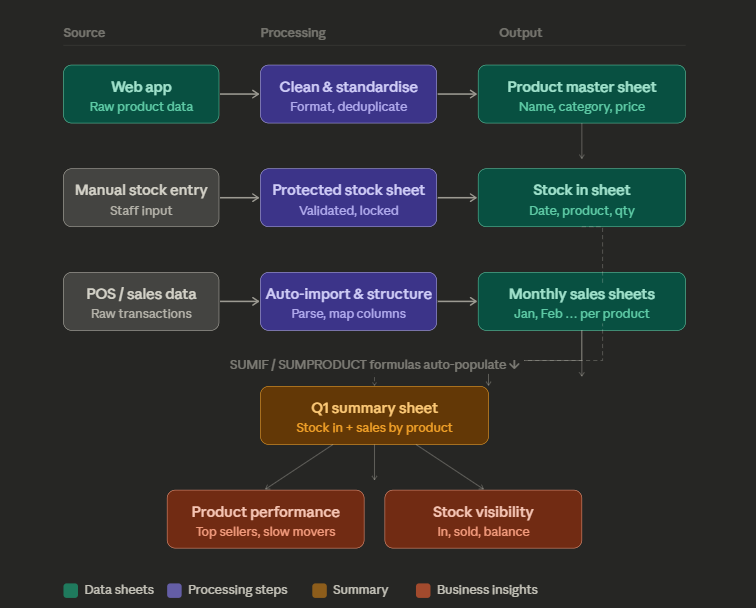
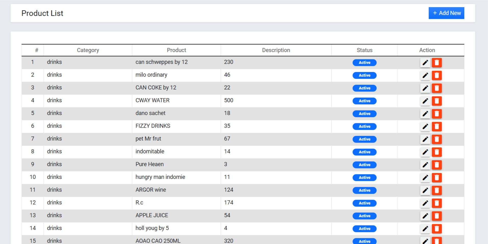
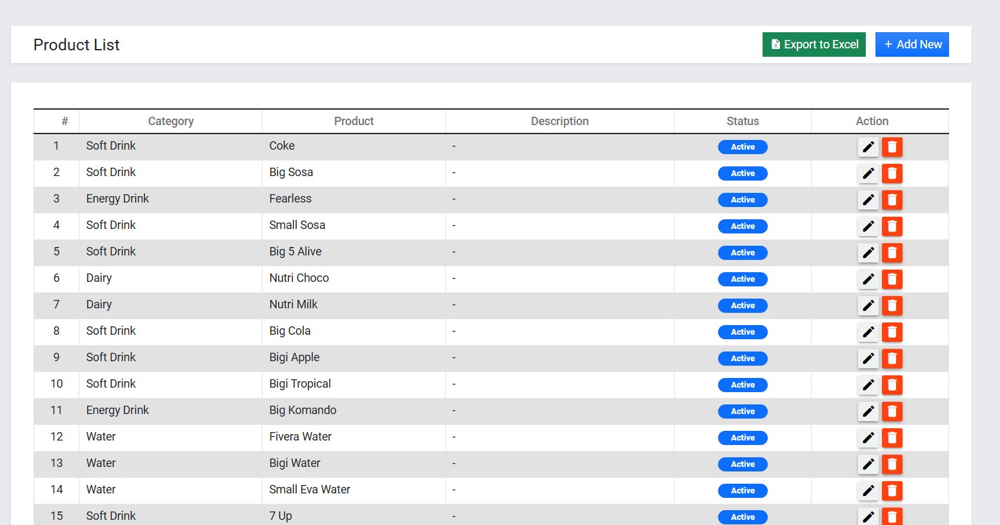
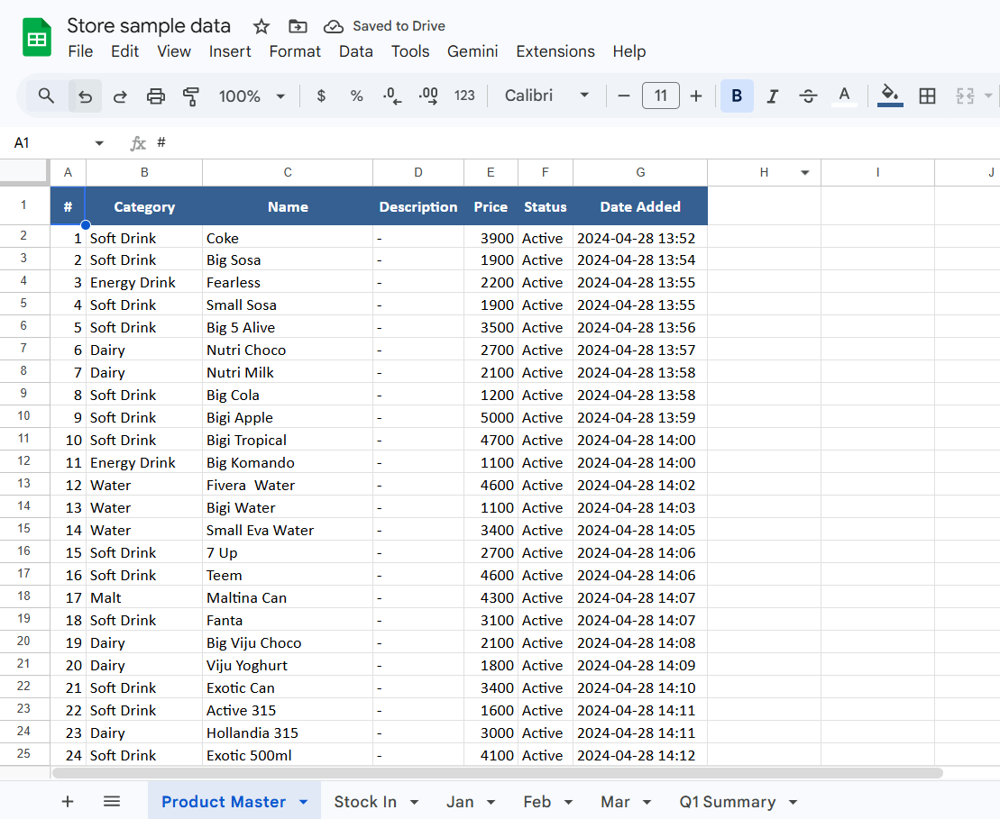
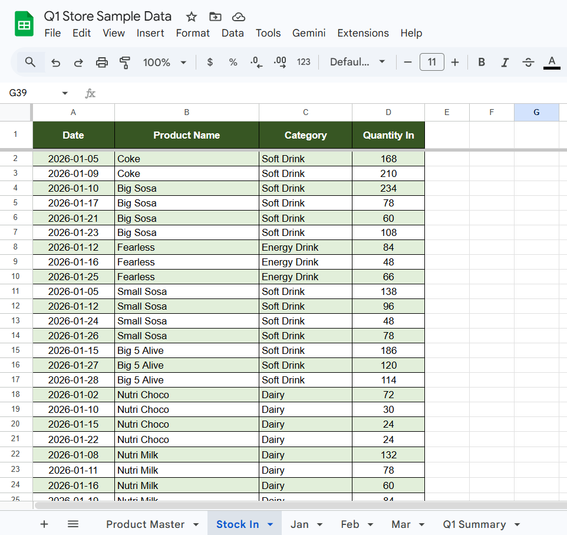
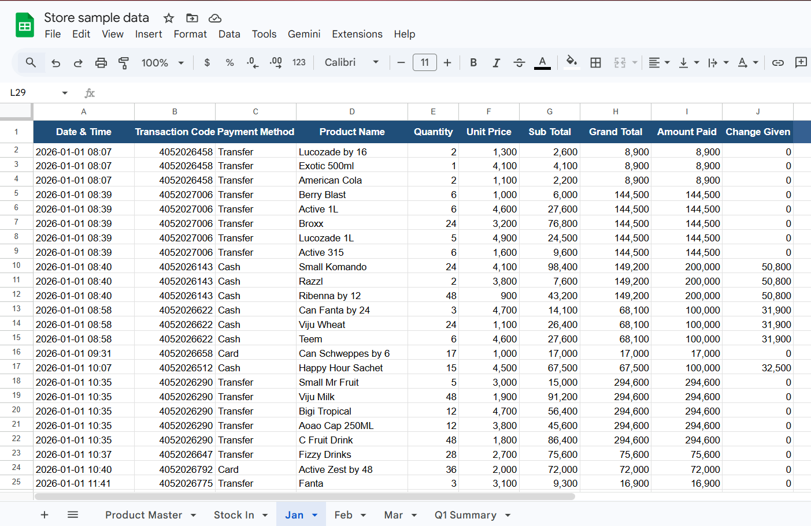
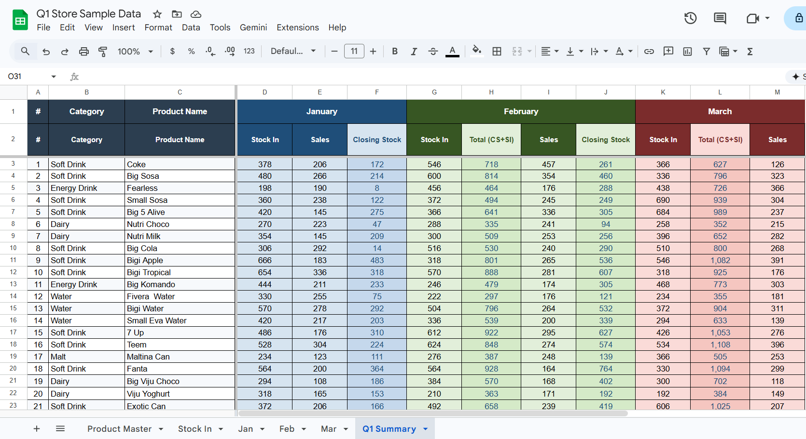

# OgoOluwa-Web3Bridge-Store-Inventory-System
End-to-end inventory and sales analytics system for a retail and wholesale store client: automated data pipelines, Excel reporting, and trend analysis to support stock and sales decisions.

### Overview

This project involved designing an automated inventory tracking and reporting system for a retail store using Google Sheets.
The goal was to clean and organize the product data on the web app, streamline stock entry, automatically import sales data from the store’s web application, and generate monthly and quarterly performance summaries.

### Business Problem

The store had sales data stored in a web application but lacked a structured reporting system to track product performance, stock levels, and sales trends.
Manual reconciliation between stock entries and sales records was time-consuming and error-prone.

### Solution

I designed a structured system consisting of:

- A Products Master workbook containing all products, categories, and pricing
- A locked Stock-In sheet for controlled inventory entry
- Monthly sales sheets that are automatically populated from the store’s web application
- Quarterly summary dashboards that calculate total stock-in and sales per product

## How It Works

---

## Before & After

### Web App Data — Before Cleaning & Automation

### Cleaned & Structured Output — After

---

## Inside the Workbook

### Product Master Sheet

### Stock In Sheet

### Monthly Sales Sheet (Jan)

### Q1 Summary — Auto-Populated

---

## Sample Data

A version of the workbook with anonymised sample data is available here:  
**[View Sample Workbook →](https://docs.google.com/spreadsheets/d/12Pz0zNgTCklbRXYlkBiPHTZdiaeD7Znui4PT0Ifhxfg/edit?usp=sharing)**

> _Note: All data shown is sample/anonymised data. It reflects the structure and logic of the actual system, not the client's real data._

---

## Tools Used

- Google Sheets (SUMIF, SUMPRODUCT, protected ranges)
- Python · openpyxl (data generation & automation)
- Excel-compatible formatting

---

## Author

**Shaleen Kihara** 
